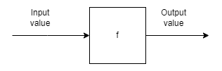

# Einführung - wieso funktionale Programmierung?

<!-- TOC -->
- [Einführung - wieso funktionale Programmierung?](#einführung---wieso-funktionale-programmierung)
	- [Lernziele](#lernziele)
	- [Begriff Funktion](#begriff-funktion)
	- [Wir wollen uns auf Funktionen verlassen können](#wir-wollen-uns-auf-funktionen-verlassen-können)
	- [Imperativ vs Deklarativ Programmieren](#imperativ-vs-deklarativ-programmieren)
	- [Funktionales Programmieren mit Scala](#funktionales-programmieren-mit-scala)
	- [Aufbau des Moduls](#aufbau-des-moduls)
	- [Quellen](#quellen)
  
<!-- TOC -->


## Lernziele
* Ich kenne den Unterschied zwischen imperativer und funktionaler Programmierung
* Ich kann einfache Funktionen schreiben
* Ich kenne die grundlegenden Bausteine, um Funktionen zu schreiben
* Ich kann den Begriff «deklarativ» erklären


## Begriff Funktion

Wir haben Funktionen bereits im Modul 319 kennengelernt, als wir z.Bsp. einen einfachen Taschenrechner programmiert haben und dabei darauf geachtet haben, dass wir jede mathematische Funktion (+, - , *, /) in eigene Methoden oder Funktionen schreiben, also z.Bsp. so: 

```
public static int add(int a, int b) {
	return a + b;
}
```

Diese Funktion erhält *zwei Zahlen als Parameter*, addiert diese und retourniert *die Summe beider Zahlen*.

Eine andere Funktion wäre z.Bsp. diese:

```
public static char getFirstCharacter(String s) {
	return s.charAt(0);
}
```


Diese Funktion erhält *einen String als Parameter* und retourniert *das erste Zeichen aus dem String*.

Beide Beispiele haben etwas gemeinsam:
*Sie erhalten Werte als Input, machen etwas damit und geben ein Resultat zurück.*
**Das ist die Eigenschaft einer Funktion.**
Grafisch dargestellt, arbeiten Funktionen stets so:




Ganz wichtig ist, dass die Funktionen stets *einen Wert retournieren*. Das ist eine wichtige Eigenschaft von Funktionen.
Wenn wir Funktionen mit einer korrekten Signatur schreiben, dann müssen wir uns als Programmierer nicht um den Inhalt in der Box kümmern. Wir können die Funktion aufrufen (die z.Bsp ein anderer Programmierer geschrieben hat) und wissen, dass wir einen Wert zurückerhalten.


## Wir wollen uns auf Funktionen verlassen können

**Quiz-Frage:**
Funktionen sollen stets einen Wert zurückgeben. Auf das wollen wir uns verlassen können.
Betrachten wir nochmals die beiden Beispiele:

```
public static int add(int a, int b) {
	return a + b;
}
public static char getFirstCharacter(String s) {
	return s.charAt(0);
}
```

**Quiz-Frage:**
bei welcher Funktion haben wir *keine Garantie*, dass wir einen Wert zurückerhalten?
* Besprechen Sie Ihre Antwort mit Ihrer Lehrperson.

Ein erstes Ziel ist es somit, dass wir eine Signatur haben, auf die wir uns verlassen können. Wir wollen sicher gehen, dass die Funktion immer einen Wert zurückgibt.
Wir werden in diesem Modul sehen, wie wir dieses Ziel erreichen.


## Imperativ vs Deklarativ Programmieren

In diesem Modul geht es darum, das imperative Programmieren vom deklarativem Programmieren zu unterscheiden.
Wir sprechen in diesem Zusammenhang auch von einem Paradigmenwechsel:
Wenn wir imperativ programmieren, dann geben wir die einzelnen Schritte im Programm vor.  Wir beschreiben somit das WIE.
Beispiel:
Wir wollen ein Programm schreiben, welches uns eine Punktzahl aus einem Wort ermittelt.
Wenn wir imperativ programmieren, würde das so aussehen:

```
public static int calculateScore(String word){
	int score = 0;
	for (char c : word.toCharArray()) {
		score++;
	}
	return score;
}

```

Wir initialisieren score mit dem Wert 0. Dann wird mittels Schleife jedes Zeichen im String durchgezählt und zu score addiert.
Wir haben somit einzelne Schritte definiert – **das WIE im Programm.**

Ganz anders, wenn wir deklarativ programmieren. Uns interessiert nicht das WIE, sondern das WAS:

```
public static int wordScore(String word){
	return word.length();
}

```

Wir wollen die Länge des Strings erhalten und kümmern uns nicht um die einzelnen Schritte, um dies zu erreichen. Wir können die *length-Methode* in Java verwenden und müssen uns nicht um einzelne Schritte kümmern, um das zu berechnen.
Ein Detail: wir haben auch den Namen der Funktion geändert – also kein Verb, sondern nur ein Nomen. Uns interessiert nur das WAS – also den «wordScore» und nicht das WIE («calculate» hat schon eher den Geschmack des WIE programmieren).


## Funktionales Programmieren mit Scala

Wir werden in diesem Modul mit der Programmiersprache Scala das Anwenden von Funktionen üben.

Eine Anleitung zu Scala und zur Installation des Plugins finden Sie hier:

https://www.youtube.com/watch?v=-8V6bMjThNo

Für das Mini-Projekt am Schluss kann auch alternativ mit Python oder JavaScript gearbeitet werden.


## Aufbau des Moduls

Wie mit allen Programmierstilen erlernt man das Programmieren vor allem durch Üben.

Wir werden in diesem Modul folgende Themen anschauen:

* [Anforderungen](../02_Anforderungen/) (wie setzen wir das WAS um statt das WIE)
* [Pure Functions](../03_PureFunctions)
* [Immutable](../03_PureFunctions/Immutable_Values) (Funktionen ohne Side-effects)
* [Funktionen als Parameter](../04_FunctionsAsValues)
* Daten strukturieren
* Mit Listen arbeiten
* [Rekursionen](../03_PureFunctions/Immutable_Values/README.md#rekursion) (und andere Algorithmen)
* Parallele Prozesse
* Wie man funktionale Programme entwirft

Dazu gibt es jeweils Unterlagen hier auf GitLab und dazu entsprechende Aufgaben.
Die Aufgaben werden je nach Angaben als Einzelarbeit oder zu zweit umgesetzt.

Auch zu dieser Einführung existieren [Aufgaben](Aufgaben/Aufgaben.md).

## Quellen

* https://de.wikipedia.org/wiki/Funktionale_Programmierung
* https://de.wikipedia.org/wiki/Programmierparadigma
  
