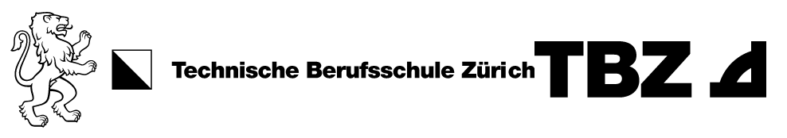

# Pure Functions
## Lernziele
* Ich kann die drei Eigenschaften erklären, die eine pure function erfüllen muss
* Ich kann die Vor- und Nachteile von pure functions erklären
* Ich kann bei bestehenden Funktionen beurteilen, ob es sich um eine [pure function](../01_Einführung/Fachbegriffe.md#pure-functions) oder [impure function](../01_Einführung/Fachbegriffe.md#impure-functions) handelt
* Ich kann impure functions so umschreiben, dass diese zu pure functions werden
* Ich kann selbst pure functions implementieren

## Merkmale einer pure function
Wenn alle die folgenden Eigenschaften erfüllt sind, ist eine Funktion eine sogenannte "pure function":
1. Gibt nur einen Wert zurück (Wenn die Funktion einen Array zurückgibt, gilt das dennoch als ein Wert - nämlich ein Array)
2. Berechnet den Rückgabewert nur aufgrund der ihr übergebenen Parameter
3. Verändert keine existierenden Werte (neue in der Funktion selber definierte Werte dürfen verändert werden)

Weil sich eine pure function an diese drei Regeln hält, ist sie [referenziell Transparent](../01_Einführung/Fachbegriffe.md#referenzielle-transparenz) - d. h. Sie könnte auch durch Ihren Return-Wert ersetzt werden, ohne dass sich die Funktionalität des Programmes ändert.

Beim 2. Punkt ist wichtig zu beachten: Wenn Sie beispielsweise die random()-Funktion verwenden, und die Zufallszahl mit dem Parameter verrechnen, dann ist die Regel bereits verletzt, weil das Resultat nicht nur von den Parametern abhängt. Sogar wenn innerhalb der Funktion "nur" mit println eine Nachricht ausgegeben wird, macht dies die Funktion "impure" weil der globale Zustand des Output-Buffers dadurch verändert wird. D. h. im Umkehrschluss: in einer pure function sind Ihnen gewisse Begrenzungen auferlegt - Sie können also nicht jede beliebige Logik mit pure functions umsetzen. Das Ziel von functional programming ist es aber so viel wie möglich pure umzusetzen, weil die Vorteile die pure functions bieten, auf der Hand liegen und die Nachteile überwiegen.

Beim 3. Punkt (keine existierenden Werte verändern) existieren die folgenden Ansätze, um diese Forderung zu erfüllen:
* **Kopie der Daten:** Die ursprünglichen Daten (Original) wird unverändert gelassen. Es wird eine Kopie der Daten erstellt, die dann verändert wird.
* **Rekursion:** Die Methode wird rekursiv aufgerufen und mit jedem neuen Aufruf werden neue "Kopien" der lokalen Variablen angelegt.

Die Anforderung keine existierenden Werte zu verändern ist eines der Kernthemen bei der funktionalen Programmierung und wird im [Unterkapitel Immutable Values](Immutable_Values) vertieft angeschaut.

### Vorteile
* **Keine Seiteneffekte:** Bei der Verwendung einer pure function treten keine Seiteneffekte auf. Sie könnten - ohne die Programmlogik zu verändern - auch den Rückgabewert anstelle des Funktionsaufrufs in den Code packen (referenziell Transparent). D. h. der Funktionsaufruf löst nichts Unerwartetes bzw. keine Statusänderung aus.
* **Einfach zu testen:** Weil die pure function nur von den Parametern abhängt, reicht der Funktionsaufruf, um diese zu testen. Bei Funktionen die auf globale Werte zugreifen und diese verwenden müssen diese globalen Werte für einen Test der Funktion zuerst noch mit sinnvollen Werten instanziiert werden.
* **Code wird klarer:** Weil keine Seiteneffekte und globalen Werte für das Codeverständnis wichtig sind, wird der Code viel einfacher zu lesen und ist sehr viel verständlicher.

### Nachteile
* **Performance:** Die vielen Kopien der Daten brauchen einerseits Speicherplatz andererseits aber auch Zeit für den Kopiervorgang. Das führt dazu, dass die Ausführung des Programmcodes in der Regel weniger performant sein wird. Um dem entgegenzuwirken, gibt es das Konzept der [lazy evaluation](../01_Einführung/Fachbegriffe.md#lazy-evaluation), wo Ausdrücke erst dann ausgewertet werden, wenn diese auch tatsächlich benötigt werden.
* **[Rekursion](../01_Einführung/Fachbegriffe.md#rekursion):** Rekursive Funktionen können nicht ganz so intuitiv zu verstehen sein. Wenn der Punkt keine existierenden Werte zu veränder mit rekursiven Funktionen gelöst wird, kann das die Verständlichkeit des Codes auch wieder etwas erschweren. Zudem kann eine sehr tiefe Rekursion dazu führen, dass der Verbrauch des Zwischenspeichers massiv anwächst und erst wieder freigegeben werden kann, wenn das Abbruchkriterium für die rekursive Funktion erreicht ist. Rekursion sollte entsprechend nur dort eingesetzt werden, wo es auch wirklich sinnvoll ist (beispielsweise dort wo Sie in der klassischen Programmierung mit while- oder for-Loops durch eine Liste von Elementen iterieren).

## Aufgaben
Sie sollten nun die drei Eigenschaften von pure functions und deren Vor- und Nachteile erklären können. Überprüfen Sie, ob dies der Fall ist, indem Sie Ihrem Banknachbarn / Ihrer Banknachbarin oder der Lehrperson pure functions erklären.

Um die restlichen Lernziele zu erreichen, lösen Sie bitte die [Übungsaufgaben](./Aufgaben/README.md).