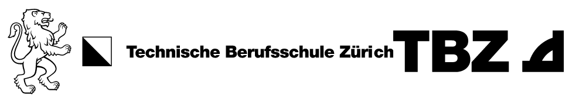

# Mini Projekt

<!-- TOC -->
- [Mini Projekt](#mini-projekt)
  - [Art und Weise](#art-und-weise)
  - [Auswahl Themen](#auswahl-themen)
  - [Anforderungen an den Code](#anforderungen-an-den-code)
  - [Bewertungsraster](#bewertungsraster)
  - [Verwendete Programmiersprache](#verwendete-programmiersprache)
  
<!-- TOC -->

## Art und Weise

Teamarbeit, Lernende suchen sich eines der unten stehenden Projekte aus. Es arbeiten 2 Personen in einem Team.  
Zeit: ca. 6-8 Lektionen mit anschliessender kurzer Präsentation bei der Lehrperson.

## Auswahl Themen

1.	**HighScore Liste**

    Verwaltung mit Lesen/Schreiben in Datei (siehe separates Arbeitsblatt).
2.	**ToDo List App**

    Verwaltung von Listen mit Aufgaben, separiert nach Kategorien (siehe separates Arbeitsblatt).
3.	**Stadtrundlauf**

    Auslesen der Teilnehmenden nach Kategorien. (siehe sep. Arbeitsblatt) 
4.	**Backtracking und Rekursion**

    8-Damen-Problem in einer Applikation lösen. (siehe sep. Beschreibung)

## Anforderungen an den Code
Ziel ist es, dass Sie in Ihrer Aufgabe möglichst Ihr Wissen aus diesem Modul umsetzen können, d.h.
* Wir verwenden Pure Functions
* Die Daten sind immutable (Daten werden kopiert oder durch Rekursion immutable gehalten)
* Wir wenden Rekursion an
* Wir arbeiten mit PatternMatching
* Wir wenden Map-Funktionen an (FlatMap, Map, Filter) oder for-comprehensions
* Wir arbeiten mit HOF (higher-order-functions) 

Die jeweilige Applikation wird über die Konsole bedient.
Stellen Sie sicher, dass Sie Ausgaben (System-outs) an einer zentralen Stelle implementieren und nicht auf Funktionen verteilen. (Trennung Businesslogik und Benutzerschnittstelle)

## Bewertungsraster

|                                                                                                                                                                   | wenig erfüllt / nicht gut | mehrheitlich erfüllt | immer erfüllt / sehr gut |
|-------------------------------------------------------------------------------------------------------------------------------------------------------------------|---------------------------|----------------------|--------------------------|
| Pure Functions vorhanden                                                                                                                                          | 0                         | 2                    | 4                        |
| Daten sind immutable gehalten                                                                                                                                     | 0                         | 2                    | 4                        |
| Rekursion wird angewendet                                                                                                                                         | 0                         | 2                    | 4                        |
| Einsatz kennengelernter Features von funktionalen Programmiersprachen (u. a. map, filter, foldLeft, for-comprehensions, pattern matching, funktionale Datentypen) | 0                         | 3                    | 6                        |
| Higher-Order-Functions                                                                                                                                            | 0                         | 2                    | 4                        |
| Umsetzung von Pipelines                                                                                                                                           | 0                         | 2                    | 4                        |
| Präsentation bei Lehrperson                                                                                                                                       | 0                         | 2                    | 4                        |
| Umgang mit Git (regelmässige code commits von allen Gruppenmitgliedern erwartet)                                                                                  | 0                         | 2                    | 4                        |

max. 34 Punkte; Benotung nach regulärer Formel: 1 + 5 ( erreichte Punkte / max.
Punkte)

## Verwendete Programmiersprache
Wichtig in diesem Auftrag ist, dass Sie die vorgestellten *Konzepte der
funktionalen Programmierung* verstehen und demonstrieren können. Sie müssen
somit nicht zwingend Scala verwenden, sondern können eine andere
Programmiersprache wählen, welche diese Konzepte abbildet. Gute Alternativen
sind JavaScript, TypeScript oder Python.

Bitte besprechen Sie das mit Ihrer Lehrperson.
